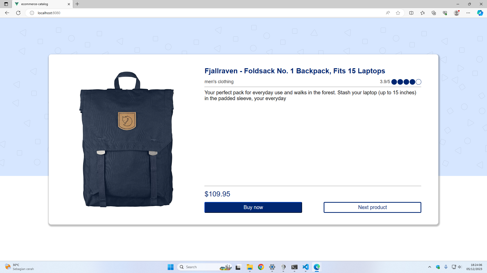
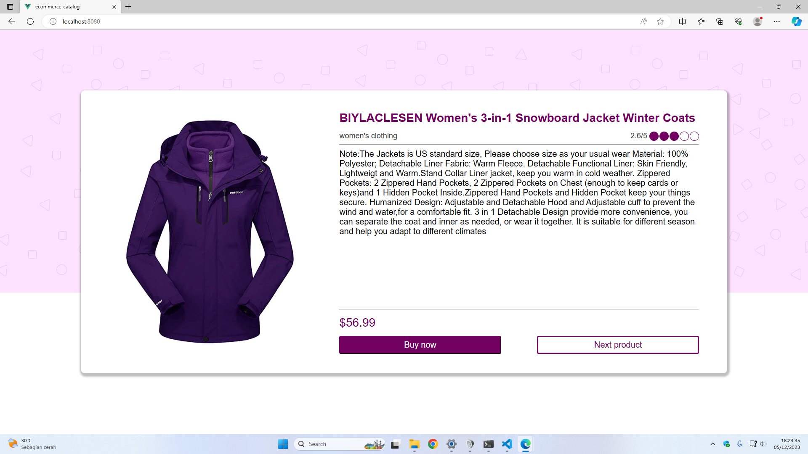
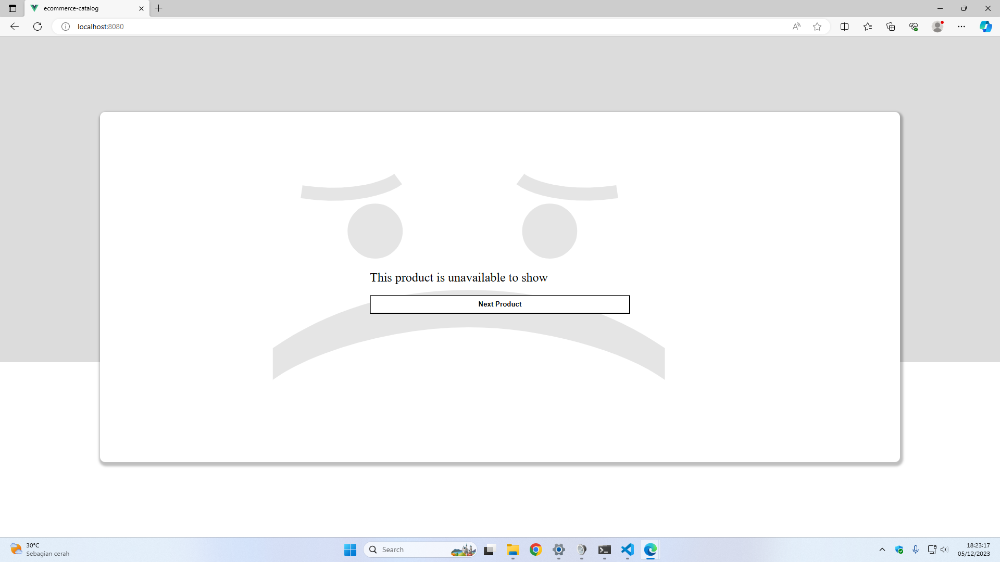

# ecommerce-catalog

## About Project
Projek ini dibuat untuk final task saya di Core Initiative Frontend Project Based Internship Program bulan November 2023

### Ketentuan final task
- Projek dibuat dengan vue.js versi 2
- Desain dibuat dengan mencontoh dari https://www.figma.com/file/x1bkO3alpmGQFtysh9Lmn7/Task-5-Ecommerce?node-id=0%3A1
- Aplikasikan desain menggunakan Vanilla CSS (CSS tanpa framework)
- Data diambil dari API https://fakestoreapi.com/products/index, data dari index 1-20
- Hanya menampilkan kategori men’s clothing dan women’s clothing
- Dibuat dengan skeleton loader saat menunggu balasan dari API

## Screenshot

<details><summary>Screenshot</summary>
<p>





</p>
</details>

## Project setup

<details><summary>Project setup</summary>
<p>

```
npm install
```

### Compiles and hot-reloads for development
```
npm run serve
```

### Compiles and minifies for production
```
npm run build
```

### Lints and fixes files
```
npm run lint
```

### Customize configuration
See [Configuration Reference](https://cli.vuejs.org/config/).

</p>
</details>